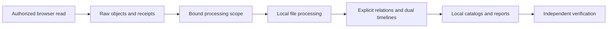
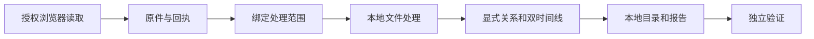

# Evidence Architecture / 证据架构

[README](../README.md) · [Processing](processing.md) · [Open-source boundary](open-source-boundary.md)

## English

### Separate the stages



Public GitHub contains the code implementing this flow, not the data moving through it. The automatic collector and manual trade channel produce separate scopes. Combining their hashes does not make an unresolved trade candidate belong to the selected customer.

### Main components

| Component | Responsibility | Not its responsibility |
| --- | --- | --- |
| Electron UI and browser manager | Login surface, selected-record page, local controls | Guessing a customer's identity or silently changing records. |
| Adapter | Visible tabs/labels, read endpoints, count paths, allowed assets | Universal discovery across unrelated CRM products. |
| Capture engine / evidence store | Source objects, manifests, receipts, hashes, reconciliation | Converting a URL/search clue into a verified business fact. |
| Full extractor | Native text, optional local OCR/media, archive recursion, task state | Replacing missing source with generated prose. |
| Relation/timeline builder | Source-backed edges, occurrences, business and capture time | Promoting ordinary co-occurrence to parenthood or inventing UTC. |
| Export builders | Human-readable catalogs, reports, database/graph packaging | Treating an Excel row cap as full-source completeness. |
| Verifiers | Counts, hashes, references, schema, integrity, honest terminal receipts | Certifying business truth from checksum equality. |

### Content identity versus occurrence identity

```text
Content object: SHA-256 of original bytes
├── Occurrence in message A, source pointer /resources/0
├── Occurrence in message B, source pointer /resources/2
└── Derived object: OCR text, source SHA + processing version
```

The original bytes can be deduplicated while all appearances and parents remain distinct. Paths and JSON pointers bind an edge to the record containing it. A manifest pointer must refer to that same manifest's artifact/record, not a similar filename in another source.

SHA-256 values use a canonical lowercase form inside the relation model. Human-facing manifests may format a digest differently, but comparisons normalize rather than change byte identity.

### Two independent timelines

| Axis | Evidence | Unknowns |
| --- | --- | --- |
| Business | Original mail/activity/order/document/trade time fields | No timezone, coarse precision, ambiguous format, missing value. |
| Capture | Session ID, request sequence, captured timestamp | A capture timestamp does not prove when a business event happened. |

Store raw text, parsed representation, zone/precision, parse state, source path, and JSON pointer. Stable source keys resolve display ties only. A reply edge should not force a child before/after a different known business timestamp. Lexicographic source-path order is not chronology.

### Identity, locking, and failure behavior

- One-shot binds one numeric record ID, disables auto-next/shared queue work, and verifies page identity before evidence writes.
- Capture startup reserves synchronously before asynchronous work, so a second Start cannot enter the same initialization window.
- Windows queue locks use an OS-owned named mutex; POSIX uses a persistent-file `flock` helper. A live owner does not expire merely because a task is old.
- Helper exit/lease loss is fail-closed. Do not fall back to an unsafe directory lock.
- Extraction has an exclusive OS case lock covering preparation/running; process death releases ownership. Only its next legitimate owner recovers interrupted tasks.
- Source scope bindings are hashes. A changed source requires a new preparation/successor, not reuse of a stale PASS.
- Archive member/byte budgets apply cumulatively across nested containers. A partial member must not become a referenced complete object.

See [troubleshooting](troubleshooting.md) before deleting anything called a lock, cache, or staging file.

### Storage authority

```text
case root (private)
├── case_identity.json       Identity binding
├── raw/                    Original session evidence
├── evidence/               Other approved evidence channels
├── manifests/              Source scopes and object/attachment references
├── verification/           Capture reconciliation and receipts
├── work/                   Local checkpoints and bound successor runs
├── derived/                Text, OCR/ASR, task database, relations, timelines
└── deliveries/             Immutable published local packages
```

Actual names vary by stage/schema; consume emitted receipts rather than constructing guessed paths. Raw objects are the authority for bytes, while the structured local database/FTS and explicit relation evidence retain extraction and lineage. Excel/DOCX/PDF are human interfaces to that authority, not replacements for it.

### Privacy model and limitations

Collection necessarily communicates with the selected CRM and approved page assets. Local processing does not send case text to an AI service. A hosted CRM page can have its own first-party traffic; “local-only” does not mean “the browser never uses the network.”

Redacted audit URLs/headers reduce credential exposure but do not anonymize source JSON, screenshots, downloaded files, filenames, or derived text. All those remain private. The release scan concerns selected **source** bytes only, not arbitrary future captures.

---

## 中文

### 分开处理阶段



GitHub 公开的是实现流程的代码，不是流经它的数据。自动采集与手动贸易通道分别生成范围。合并哈希不会让未识别贸易候选自动成为选定客户。

### 主要组件

| 组件 | 职责 | 不负责 |
| --- | --- | --- |
| Electron 界面/浏览器管理 | 登录面、选定记录页、本地控制 | 猜客户身份或悄悄换客户。 |
| 适配器 | 可见标签、读取接口、数量路径、资源域 | 自动适配所有其他 CRM。 |
| 采集引擎/证据库 | 原件、清单、回执、哈希和对账 | 把一个 URL/线索当成业务事实。 |
| 全文提取器 | 原生文字、可选本地 OCR/媒体、压缩递归、任务状态 | 用生成文字替代失去的源内容。 |
| 关系/时间线构建器 | 来源支持的边、出现实例、业务/采集时间 | 把共现升级父子，或编 UTC。 |
| 导出器 | 人读目录/报告，数据库/图打包 | 把 Excel 行数上限当源完整。 |
| 验证器 | 数量、哈希、引用、结构、完整性、真实终态 | 从哈希相等证明业务事实正确。 |

### 内容身份与出现身份

```text
内容对象：原件字节的 SHA-256
├── 出现在邮件 A，来源指针 /resources/0
├── 出现在邮件 B，来源指针 /resources/2
└── 派生对象：OCR 文字、来源 SHA + 处理版本
```

原件可以物理去重，但出现和父级必须分别保留。路径与 JSON 指针把关系绑定到包含它的记录。清单指针必须指向同一清单的 artifact/record，不能借另一个相似文件名。

关系模型内部 SHA-256 统一小写。人读清单可能采用不同字母格式，但比较应标准化，不能改变字节身份。

### 两套独立时间线

| 轴 | 证据 | 未知因素 |
| --- | --- | --- |
| 业务 | 邮件/动态/订单/文档/贸易原始时间字段 | 无时区、精度低、格式歧义、缺值。 |
| 采集 | 会话 ID、请求序号、采集时间 | 采集时间不证明业务发生时间。 |

保留时间原文、解析表示、时区/精度、解析状态、来源路径和 JSON 指针。稳定来源键仅解决展示同序。回复边不能强迫子项跨已知业务时间排序。路径字典序不是时间顺序。

### 身份、锁与失败行为

- one-shot 绑定一个数字记录 ID，禁用自动下一客户/共享队列，写证据前核对页面身份。
- Start 在异步工作前同步预留，第二次点击不会钻进初始化竞争窗口。
- Windows 队列用 OS 命名互斥；POSIX 用持久锁文件 `flock`。活进程不能只因任务时间长就过期。
- helper 退出/租约丢失必须关闭失败，不退回不安全目录锁。
- 提取 prepare/run 共用案例独占 OS 锁，进程死亡后释放；只有下一个合法持有者可恢复中断任务。
- 来源范围由哈希绑定；源改变就新 prepare/新后继运行，不能复用旧 PASS。
- 压缩字节/成员预算跨递归容器累计，半个文件不能成为完整对象引用。

删除任何名为 lock/cache/stage 的材料之前，先看 [避坑](troubleshooting.md)。

### 存储权威

```text
案例根目录（私密）
├── case_identity.json       身份绑定
├── raw/                    原始会话证据
├── evidence/               其他认可证据通道
├── manifests/              范围及对象/附件引用
├── verification/           采集对账和回执
├── work/                   检查点与绑定后继运行
├── derived/                文字、OCR/ASR、任务库、关系、时间线
└── deliveries/             不可覆盖的本地最终包
```

不同阶段/结构命名可能不同，应消费实际回执，不能猜路径。原件是字节权威；结构化数据库/FTS 与明确关系证据保留提取和血缘。Excel/DOCX/PDF 是人读接口，不是替代权威。

### 隐私模型和限制

采集必然连接选定 CRM 和允许资源。本地处理不把案例文字上传 AI。托管 CRM 页面本身可能有第一方流量；“本地处理”不代表浏览器永远不联网。

审计 URL/请求头脱密能减少凭据暴露，但不会匿名原始 JSON、截图、文件、文件名或派生文字，这些仍全部私密。发布扫描只针对选定**源码**，不覆盖未来任意采集物。
